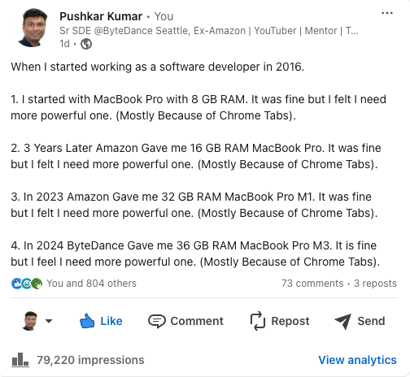

<!-- TABLE OF CONTENTS -->
<details>
  <summary>Table of Contents</summary>
  <ol>
    <li>
      <a href="#about-the-project">About The Project</a>
      <ul>
        <li><a href="#built-with">Built With</a></li>
      </ul>
    </li>
    <li>
      <a href="#getting-started">Getting Started</a>
      <ul>
        <li><a href="#installation">Installation</a></li>
      </ul>
    </li>
    <li><a href="#usage">Usage</a></li>
    <li><a href="#contact">Contact</a></li>
  </ol>
</details>

<!-- ABOUT THE PROJECT -->
## About The Project



The Above Linkedin post got over 800+ likes. 
So I belive many developers faced this problem. 
So why not to fixed it. 

<p align="right">(<a href="#readme-top">back to top</a>)</p>

### Built With

* HTML
* JavaScript

<p align="right">(<a href="#readme-top">back to top</a>)</p>

### Installation

_Below is an example of how you can instruct your audience on installing and setting up your app. This template doesn't rely on any external dependencies or services._

1. Clone the repo
   ```sh
   git clone git@github.com:pushkarkumar-dev/ChromeTabsRemoval.git
   ```
2. Open Chrome and navigate to ```chrome://extensions/.```

3. Enable "Developer mode" in the top right corner.

4. Click "Load unpacked" and select the directory containing your extension files.


<p align="right">(<a href="#readme-top">back to top</a>)</p>

<!-- USAGE EXAMPLES -->
## Usage

1. Close the chrome, and restart.
2. Current Configuration restricts a total of 10 chrome tabs.
2. If you want more, update MAX_TABS in ```background.js```.


<p align="right">(<a href="#readme-top">back to top</a>)</p>

<!-- CONTACT -->
## Contact

Pushkar - [@Linkedin](https://www.linkedin.com/in/pushkar1005/)

Project Link: [https://github.com/pushkarkumar-dev/ChromeTabsRemoval](https://github.com/pushkarkumar-dev/ChromeTabsRemoval)

<p align="right">(<a href="#readme-top">back to top</a>)</p>